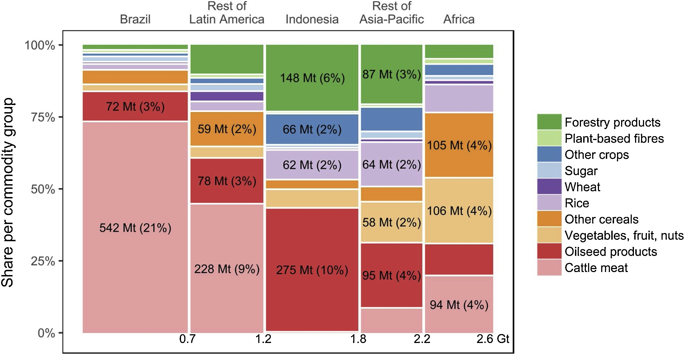
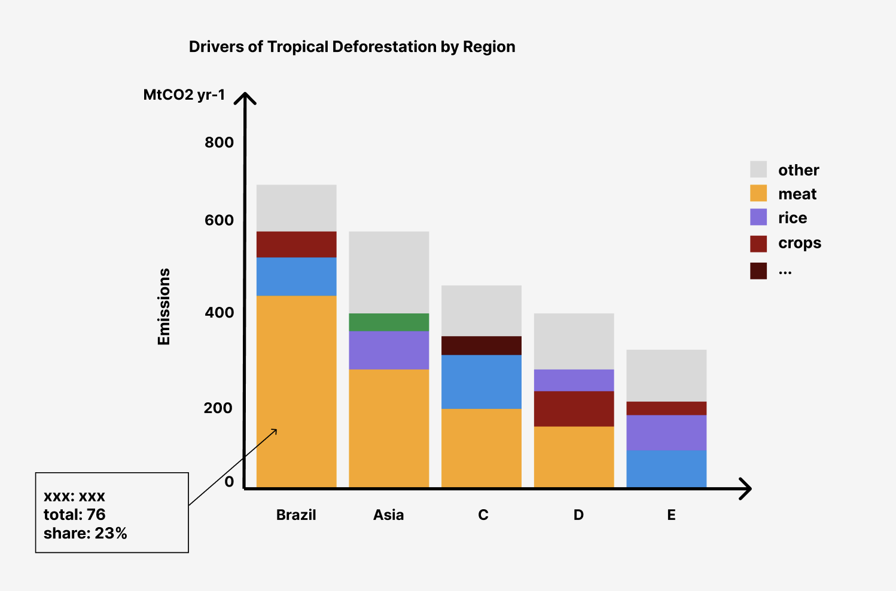

# Critique by Design

## Table of Contents

- [Original Data Visualization](#original-data-visualization)
- [Data Visualization Critique](#data-visualization-critique)
- [Wireframe](#wireframe)
- [Solution Test](#solution-test)
- [Recreated Data Visualization](#recreated-data-visualization)
- [Conclusion](#conclusion)
- [References](#References)

## Original Data Visualization

The world is losing forests on a large scale every year, with a large portion of this occurring in the tropics. Deforestation is one of the largest sources of anthropogenic greenhouse gas emissions, driven primarily by expanding forestry and agriculture. Although agricultural expansion is increasingly driven by foreign demand, the links between deforestation and foreign demand for agricultural commodities have only been partially mapped. If we want to address deforestation, we need to know what causes it. 

There are large geographic variations in what commodities are associated with deforestation-related emissions. A good visualization of the results can provide the rationale for governments to guide agricultural production and help scientists to innovate ways to produce them. The relevant chart in the selected article has some redundancies and is not intuitive enough for non-professionals such as government officials and farmers to read. Therefore, it is selected for detailed critique and redesign.

Here is the [Source Link](https://www.sciencedirect.com/science/article/pii/S0959378018314365#fig0005) and below is the image. 

## Data Visualization Critique

### Overall Observations
This data visualization is very ineffective in terms of perceptibility and intuitiveness. The information isn't displayed in a manner that the human eye and brain can perceive with minimal effort and appropriate precision. Forcing people to compare the sizes and width of bars, is somewhat difficult and imprecise when the lengths of bars could have been used instead. Also, stacked percentage bar charts would be unfamiliar to the general public. Classifying countries by region is a very effective way, but there are both countries and regions on the chart with no explanations. In fact, I think it will be better to make an additional visualization or some explanations ahead of this one for the share of tropical deforestation by country, which would serve as the basis for the country classification. Aesthetically, it isn’t quite pleasing to the eye, in part because too many colors are stacked to create a cluttered appearance. I think all unimportant information can be considered replaced with gray. Too many numbers labeled is also a problem, it is sufficient to label only the top three drivers as percentages. The visualization works well in terms of usefulness, completeness, and truthfulness. The message it conveys is very meaningful to the audience of this visualization and facilitates countries looking for ways to reduce carbon emissions with purpose.

### The Effectiveness of this Visualization in Reaching the Primary Audiences
Experts, professors, and students in the field of environmental science, relevant government officials, farmers, and some environmentalists are the primary audience for this visualization. I think this visualization is not very effective for reaching that audience. The chart performs very well in terms of both truthfulness and completeness. Audiences like experts and professors want to see the most accurate numbers and the most comprehensive information, and are open to taking the time to research and draw their own conclusions, the intuitiveness of this chart is not a problem for them. However, for the general public like officials, farmers, and environmentalists, the shortcomings in perceptibility, intuitiveness, and aesthetics will have a great impact on them. They will find it hard to get what the visualization conveys the first time.

## Wireframe

### Things I Plan to Change
- Add a meaningful title
- Replace the stacked percentage bar chart with a regular stacked bar chart
- Mark the unimportant drivers as gray to highlight the key ones
- Change the position of product groups, from bottom to top by the influence
- Add interactivity and avoid unnecessary information display

### Sketch

## Solution Test

### Feedbacks

#### Student 1, early 20's
- This reflects some of the most important drivers of tropical deforestation in each region.
- Everyone can be the intended audience for this visualization.
- I can quickly name the top three major contributors in each area, but it's hard to see the percentage of each contributor in the aggregate. But that's not the purpose of this chart, is it?
- You could add the percentage tag, I think. It's interactive, but you can't remember so many numbers at once. Adding labels would be more intuitive.

#### Student 2, mid 20's
- I can quickly see what the chart is trying to convey, and I think this visualization is very straightforward.
- The other in each region is a collection of unimportant drivers, am I understanding this correctly?
- I noticed that the colors are sorted differently in each column, I think you have them by size, but I think it's more logical to have a consistent order of product types.
- Why not mark the numbers? If it were my work, I would do it.
- It must be percentages, absolute values do little to convey the meaning of this chart.

#### Environmentalist, mid 30's
- This is a graph that represents some important drivers of tropical deforestation in different regions.
- I think I am the intended audience for this.
- It looks good to me, I don't think it has any parts that need to be changed.
- If I have to say, you can adjust the color, it may look a little better.

### Reflections and Insights

## Recreated Data Visualization
<iframe src="https://public.tableau.com/views/Assignment_16636996624560/1?:showVizHome=no&:embed=true" width="98%" height="600" seamless frameborder="0" scrolling="no"></iframe>   

## Conclusion 

## References
1. [Few, Stephen. “Data Visualization Effectiveness Profile,” 2017, 11.](http://www.perceptualedge.com/articles/visual_business_intelligence/data_visualization_effectiveness_profile.pdf)

2. [Pendrill, F., Persson, U., Godar, J., Kastner, T., Moran, D., Schmidt, S., & Wood, R. (2019). Agricultural and forestry trade drives large share of tropical deforestation emissions. Global Environmental Change, 56, 1-10. doi: 10.1016/j.gloenvcha.2019.03.002](https://www.sciencedirect.com/science/article/pii/S0959378018314365#fig0005)

[Back to top](#table-of-contents)

[Go back to portfolio](/README.md)
