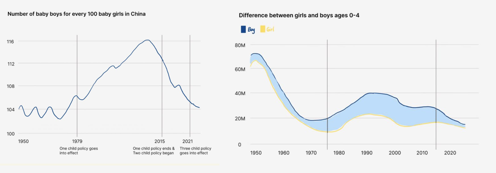
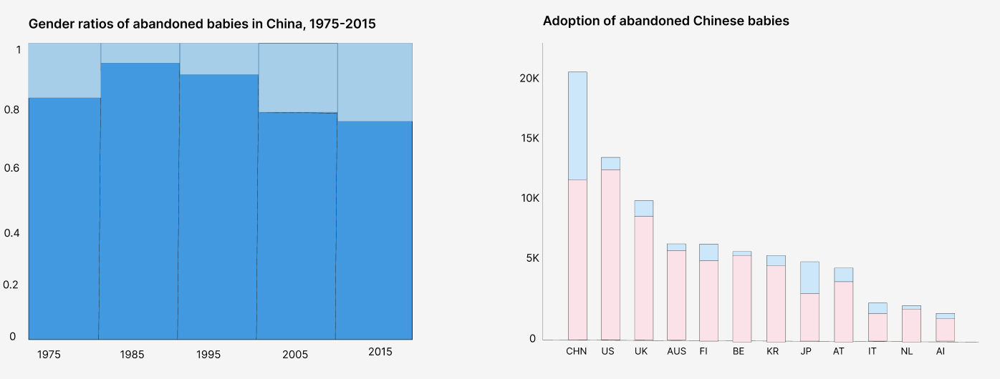
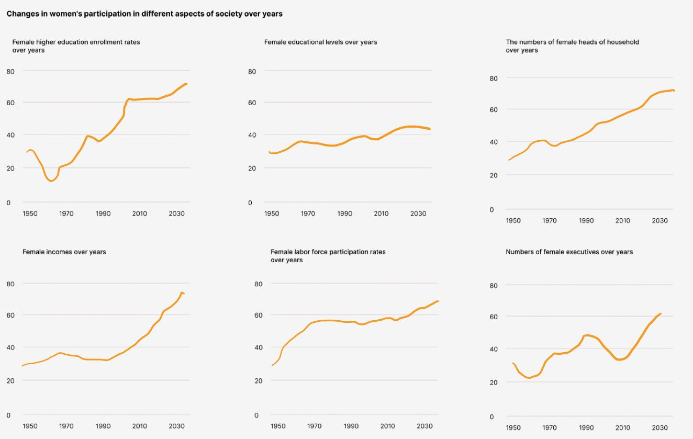

# Effects of the One-Child Policy on Gender Equality 

In 2015, China's one-child policy, which had been conducted for 35 years, came to an end, and the country has now entered the three-child era. There are many theoretical studies on the impact of the one-child policy on women, but the field of presentation of relevant data and overall narratives is still a gap. Taking the opportunity of the final project, I decided to tell the story using data visualization methods.

## Table of Contents for Part I

- [Outline](#outline)
- [Initial Sketches](#initial-sketches)
- [Primary Data Source](#primary-data-source)
- [Method and Medium](#method-and-medium)

## Outline

This project will focus on the impact of China's one-child policy on sex ratio and gender equality, comparing the contrasting phenomena of the disappearance of mass female babies and the advancement of woman's rights under this policy. Through the combination of data visualizations and storytelling, the project aims to raise people‘s awareness of gender issues and the reflection on this policy.

The following are the main elements that make up the structure of my story.

- Introduction: Using the phenomenon that millions of men in China now find it difficult to get married to provoke thoughts on where the missing girls have gone. On the other hand, elaborating on the rising status of women in China, more and more women are getting married at later ages or are even unwilling to get married, which is also a reason why men are having trouble finding wives. Both reasons are inextricably linked to China's one-child policy.

  - A brief overview of China's fertility policy.

- Chapter 1 - Missing Girls: Visualizing the sex ratios of annual births, the differences in numbers between males and females by age, etc. to reveal the phenomena caused by the one-child policy such as baby abandonment and abortion.

  - Visualize the gender ratios of abandoned babies each year and the adoption of abandoned girls. Tell the story of a Chinese girl who was adopted intercountry.

- Chapter 2 - The Awakening of Female Power: By visualizing the annual changes in female higher education enrollment rates, female educational levels, the numbers of female heads of household, female incomes, female labor force participation rates, and the numbers of female executives, etc., the project can reveal the contribution of the one-child policy to the advancement of women's rights and the overall status of women.

  - Through telling true stories to explore the random nature of women’s empowerment and the dilemmas of the urban only-daughter.

- Chapter 3 - Prospects: The project will analyze the future situation through changes in data related to the sex ratios under the one-child, two-child, and three-child policies.

- Conclusion: Extract the ideas and summarize the content discussed above.

## Initial Sketches
 
Sketches for Chapter 1.

Sketches for Chapter 2.

Additional Notes:
These are only the initial designs of the visualizations, after which more visualizations such as birth rates by gender by province may be added.

## Primary Data Source

1. [China Statistical Yearbooks Compiled by National Bureau of Statistics of China.](http://www.stats.gov.cn/english/Statisticaldata/AnnualData/)
This website contains the official annual statistical databases of China. From this data source, this project can obtain information on the gender ratio of birth rates, the number of males and females in different age groups, the college enrollment rates of different genders, and the annual income of different genders.

2. [.]()

3. [The One-Child Policy and Gender Equality in Education in China: Evidence from Household Data.](https://link.springer.com/article/10.1007/s10834-011-9277-9)
The dataset from this article can provide support for studying the impact of the one-child policy on gender equality in education in China. This project will use this data source to study the difference in years of schooling between only-child boys and only-child girls, and the difference in years of schooling of only-child girls and girls from multi-child families in China.

4. [.]()

5. [.]()

6. [.]()

## Method and Medium

### Method

The project will be completed in the following steps.

- Define the project theme and outline.

- Determine the content of the story and visualizations, as well as set up plots for the story.

- Search and analyze the required data and information.

- Determine the tools to be used.

- Preliminary sketching based on data and the story.

- Conduct data visualization using Tableaus and Flourish.

- Write the story.

- Build the story with Shorthand.

- Check content and references.

- Present and reflect.

### Medium
Excel and Python will be used for simple data cleaning and processing, Tableau and Flourish will be used for data visualization, and Shorthand will be used for overall story building. They are all powerful and easy-to-learn platforms and tools through which the planned output could be efficiently accomplished. In addition, Shorthand forms web pages that are far more interactive than slides, making it ideal for supporting storytelling with data.

[Back to top](#table-of-contents-for-part-i)

[Go back to portfolio](/README.md)
